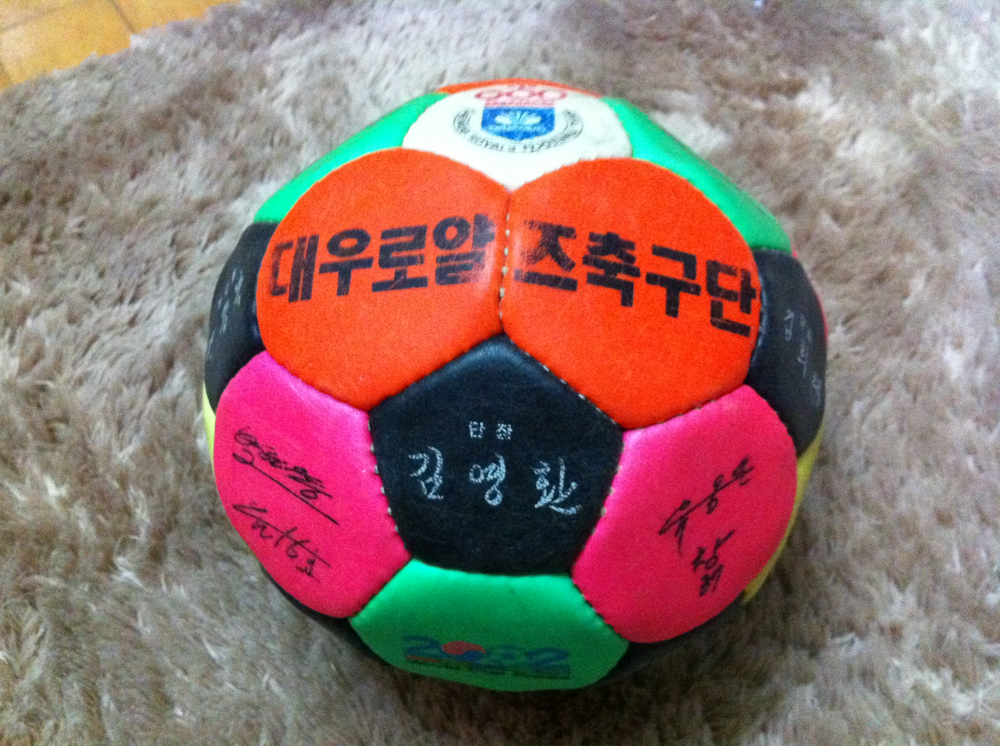
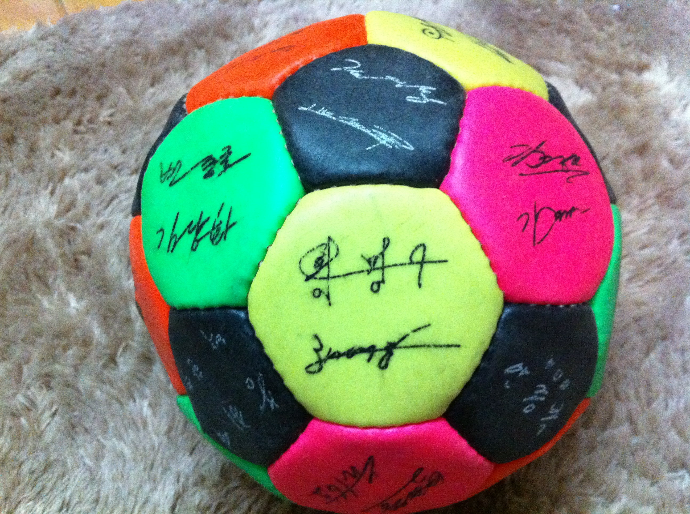

[index.html](https://github.com/user-attachments/files/29154937/index.html)
<!DOCTYPE html>
<html lang="ko">
<head>
<meta charset="UTF-8">
<meta name="viewport" content="width=device-width, initial-scale=1.0">
<title>출판 제안서 — 그라운드 밖의 리더십 · 황명구</title>

</head>
<body>

<!-- ── NAV ── -->
<nav>
  
황명구 <em>·</em> HMG

  <ul class="nav-links">
    <li><a href="#author">저자 소개</a></li>
    <li><a href="#journey">삶의 여정</a></li>
    <li><a href="#book-proposal">책 소개</a></li>
    <li><a href="#chapters">목차</a></li>
    <li><a href="#media">미디어</a></li>
    <li><a href="#vision">비전</a></li>
    <li><a href="#pitch">출판 제안</a></li>
  </ul>
  
출판사 제안서

</nav>

<!-- ── COVER ── -->
<section id="cover">
  

    

      

        ✦ BOOK PROPOSAL &nbsp;·&nbsp; 출판 제안서
      

      <h1 class="cover-book-title">
        그라운드 밖의 리더십
      </h1>
      

        축구선수에서 정책전문가까지, 한 사람의 전환과 확장의 기록
      

      

      
황명구 지음

      

        프로축구선수 · 축구지도자 · 대학 행정가 
        정책전문가 · 전략전문가 · 이학박사
      

    

    

      

      

      

      

      

    

  

  

    

      <!-- 이미지: images/01_profile_main.jpg -->
      
    

    

    

      
황명구

      
HWANG MYOUNG GOO

    

  

</section>

<!-- ── AUTHOR PROFILE ── -->
<section id="author" class="section">
  

    
저자 소개

    

      

        

          <!-- 이미지: images/02_profile_smile.jpg -->
          
          
황

        

      

      

        
황명구 — Hwang Myung-gu

        <h2 class="sec-title reveal">현장성과 학문성, 실행력과 전략을 겸비한 융합형 전문 리더</h2>
        

          황명구는 프로축구선수 출신의 현장형 리더이자, 선수와 지도자 경험을 바탕으로
          대학 행정, 정책, 전략, 지역협력, ESG 분야로 전문성을 확장해 온 융합형 실천 전문가이다.
        

        

          경북 울진에서 출생하여 서울 도림초·영도중학교, 충북 청주상업고등학교를 거쳐 충남대학교에 진학하였다.
          부산 대우로얄즈 프로축구단에서 선수 생활 후 대전 봉산중학교 신생팀 지도자를 맡아
          대전 대표로 소년체전에 참가하는 성과를 거두었다.
          이후 충남대학교에서 27년간 학생지도, 취업지원, 창업지원, 지역협력, ESG 업무를 수행하였다.
        

        

          한남대학교 교육학 석사, 충남대학교 이학박사를 취득하고 카이스트 지식재산전략 최고위과정을 수료하였으며,
          행정사 및 스포츠전문지도사 자격을 갖추어 학문적 기반과 제도적 전문성을 함께 완성하였다.
        

        

          

            
학위

            
이학박사 (충남대) 교육학 석사 (한남대)

          

          

            
자격

            
행정사 스포츠전문지도사

          

          

            
선수 경력

            
대우로얄즈 프로축구단

          

          

            
행정 경력

            
충남대학교 27년 재직 ESG센터 · 취업·창업지원

          

          

            
연수 과정

            
카이스트 지식재산전략 최고위과정

          

          

            
대외 활동

            
대전교도소 교정위원 ESG·지역협력 전문가

          

        

      

    

  

</section>

<!-- ── JOURNEY ── -->
<section id="journey" class="section">
  

    
삶의 여정

    <h2 class="sec-title reveal">내 삶은 왜 늘 새로운 운동장을 향해 갔는가</h2>
    

      멈춤은 끝이 아니라 전환이었다. 운동장에서 시작된 여정은 지도자의 현장으로,
      대학과 지역의 현장으로, 그리고 학문과 전략의 영역으로 끊임없이 확장되어 왔다.
    

    

      

        

        
프로선수 시절 · 부산 대우로얄즈

        
축구, 첫 번째 인생의 무대

        

          충남대학교 졸업 후 부산 대우로얄즈 프로축구단에 입단, 선수의 길을 걸었다.
          팀을 위한 헌신과 경쟁 속에서 버티는 힘을 온몸으로 익혔다.
          뜻하지 않은 부상이 선수 생활을 멈추게 하였고, 인생의 첫 번째 전환점이 찾아왔다.
        

        

          

            <!-- 이미지: images/08_ball_front.jpg (대우로얄즈 사인 공 앞면) -->
            
            
⚽팀 사인 기념 축구공

          

          

            <!-- 이미지: images/09_ball_back.jpg (사인 공 뒷면 — 황명구 서명) -->
            
            
✍️황명구 친필 사인 — 대우로얄즈 기념구

          

        

        

          "많은 사람은 멈춤을 실패라고 여긴다. 하지만 내게 멈춤은 끝이 아니라 전환이었다."
        

      

      

        

        
지도자 시절 · 대전 봉산중학교

        
사람을 키우는 사람

        

          선수에서 지도자로 전환하여 대전 봉산중학교 신생 축구팀을 맡았다.
          대전 대표로 소년체전에 참가하는 성과를 거두며 지도자로서 역량을 인정받았다.
          직접 뛰는 것보다 누군가가 더 잘 뛸 수 있도록 돕는 일이 더 깊은 책임임을 처음 깨달은 시기였다.
        

        

          <!-- 이미지: images/04_coaching.JPG (봉산중 헹가래 사진) -->
          
          

            🏃
            봉산중학교 축구팀 · 소년체전 대전 대표
          

        

        

          "선수로 뛸 때는 나 자신을 훈련했다. 지도자가 된 뒤에는 사람을 키우는 법을 배웠다."
        

      

      

        

        
대학 행정 · 충남대학교 27년

        
대학과 지역을 잇다 — 27년의 현장

        

          충남대학교 교직원으로 이직한 뒤 학생지도, 취업·창업지원, 지역협력, ESG 업무에 이르기까지
          대학 행정의 전 영역에서 27년간 실무 경험을 축적하였다.
          정부 재정지원사업, 청년 인재양성 사업, 지자체 협력사업, 공공가치 기반 프로젝트를 기획·운영하였다.
        

        

          "진짜 변화는 현장을 모르는 사람이 아니라, 현장에서 사람을 만나고 문제를 이해한 사람이 만들 수 있다."
        

      

      

        

        
학문 · 석사 → 박사 취득

        
현장 위에 학문을 쌓다

        

          현장 경험에 머물지 않고 한남대학교 교육학 석사, 충남대학교 이학박사를 취득하고
          카이스트 지식재산전략 최고위과정을 수료하였다.
          행정사·스포츠전문지도사 자격도 갖추며 학문적 기반과 제도적 전문성을 함께 완성하였다.
        

        

          <!-- 이미지: images/10_graduation.PNG (박사 학위 수여식) -->
          
          

            🎓박사 학위 수여식
          

        

        

          "그것은 스펙을 쌓기 위한 과정이 아니었다. 현장을 더 정확히 이해하고 사람과 조직, 정책과 지역을 더 효과적으로 연결하기 위한 또 하나의 훈련이었다."
        

      

    

  

</section>

<!-- ── BOOK PROPOSAL ── -->
<section id="book-proposal" class="section">
  

    
출판 제안 도서

    <h2 class="sec-title reveal">그라운드 밖의 리더십</h2>
    

      

        

          

            
HWANG MYOUNG GOO · 황명구

          

          

            
그라운드 밖의 리더십

            
축구선수에서 정책전문가까지, 한 사람의 전환과 확장의 기록

          

          

            

            

            
황명구 지음

            
현장 리더십 · 학문적 리더십 · 공공적 실행력 융합형 전문 리더

          

        

      

      

        

          
✦ 책의 핵심 메시지

          

            "운동장에서 배운 실행력, 사람을 키우며 익힌 리더십, 학문과 자격으로 완성한 전문성.
            한 사람의 삶은 결국 사람과 조직, 대학과 지역을 연결하는 길이 되었다."
          

        

        

          
📖 책의 성격

          

            이 책은 한 사람의 경력을 나열한 기록이 아니다.
            현장과 학문, 실천과 성찰, 개인의 도전과 공동체의 책임이 만나
            하나의 삶을 이루어 온 과정에 대한 이야기이다.
            전환은 끝이 아니라 확장임을 보여주는 실천형 리더의 성장 서사.
          

        

        

          
📊 도서 정보

          

            분류: 자서전 · 에세이 · 리더십 
            구성: 프롤로그 + 5부 16장 + 에필로그 
            예상 분량: 약 280~320페이지 
            상태: 집필 및 편집 진행중
          

        

      

    

  

</section>

<!-- ── CHAPTERS ── -->
<section id="chapters" class="section">
  

    
목차 구성

    <h2 class="sec-title reveal">5부 16장의 여정</h2>
    

      프롤로그부터 에필로그까지 — 한 사람의 전환과 확장의 이야기를 시간의 흐름과 주제의 깊이로 구성하였다.
    

    

      

        
프롤로그

        
내 삶은 왜 늘 새로운 운동장을 향해 갔는가

        
삶의 방향성과 핵심 메시지

        ✓ 완료
      

      

        
제1부 · 1~3장

        
뿌리와 꿈

        
울진, 서울, 청주, 대전으로 이어진 성장기

        

          1장. 울진, 삶의 기초를 배우다
          2장. 서울에서 세상을 넓히다
          3장. 청주에서 현실을, 대전에서 꿈을
        

        ✏ 집필중
      

      

        
제2부 · 4~6장

        
축구, 첫 번째 인생의 무대

        
대우로얄즈 입단부터 전환점까지

        

          4장. 선수의 길, 충남대에서 대우로얄즈까지
          5장. 프로의 세계 — 부산에서 배운 것들
          6장. 멈춤이 전환이 되다
        

        ✏ 집필중
      

      

        
제3부 · 7~9장

        
사람을 키우는 사람

        
봉산중학교 지도자 시절과 현장 리더십

        

          7장. 지도자의 길로 들어서다
          8장. 봉산중, 0에서 시작한 팀 만들기
          9장. 직접 뛰는 것보다 어려운 것
        

        ○ 예정
      

      

        
제4부 · 10~13장

        
대학과 지역을 잇다

        
충남대 27년, ESG, 정책, 지역협력

        

          10장. 충남대, 새로운 운동장
          11장. 학생을 키우고 지역을 연결하다
          12장. ESG와 공공가치의 실행
          13장. 정책을 현장으로 가져오다
        

        ○ 예정
      

      

        
제5부 · 14~16장 + 에필로그

        
그라운드 밖에서도 나는 뛰었다

        
학문적 심화, 미래 비전, 다음 장으로

        

          14장. 석박사, 현장을 학문으로 다듬다
          15장. 융합형 리더의 완성
          16장. 사람·지역·대학·미래를 잇다
          에필로그. 내 삶의 다음 장
        

        ○ 예정
      

    

  

</section>

<!-- ── MEDIA ── -->
<section id="media" class="section">
  

    
미디어 · 활동 · 강연

    <h2 class="sec-title reveal">현장이 검증한 전문가의 기록</h2>
    

      MBC 방송 출연부터 대전 ESG 포럼 발표까지 — 황명구의 전문성은 이미 공공의 장에서 검증되어 왔다.
    

    

      

        

          <!-- 이미지: images/07_mbc.JPG (MBC 방송 출연) -->
          
          

            📺
            MBC 방송 출연
          

        

        

          
TV 출연 · MBC

          
MBC 뉴스 — 취업지원 전문가 패널

          
충남대학교 취업지원팀장으로 청년 취업 문제를 논한 MBC 방송 패널 출연

        

      

      

        

          <!-- 이미지: images/05_esg_speech.jpg (ESG 포럼 발표) -->
          
          

            🎤
            ESG 포럼 발표
          

        

        

          
강연 · 2025 대전 ESG 포럼

          
2025 대전 SDGs-ESG 경영포럼 발표

          
대전컨벤션센터(DCC) — 지속가능한 지역발전 전략 주제 발표

        

      

      

        

          <!-- 이미지: images/06_esg_panel.jpg (ESG 패널 토론) -->
          
          

            💬
            ESG 패널 토론
          

        

        

          
토론 · 2025 대전 ESG 포럼

          
ESG 실천과 혁신을 잇다 — 패널 토론

          
대학·지역협력·공공성 기반 ESG 전략을 주제로 한 패널 토론 참여

        

      

    

  

</section>

<!-- ── VALUES ── -->
<section id="values" class="section">
  

    
핵심 가치와 철학

    <h2 class="sec-title reveal" style="color:#fff">현장 · 사람 · 연결 세 가지 기둥</h2>
    

      황명구의 삶 전반에 흐르는 세 가지 원칙. 이 세 가지는 분리되지 않고 하나로 연결되어 가치를 만들어 낸다.
    

    

      

        
🏟

        
현장이 먼저다

        

          책상 위 전략보다 실제 현장에서의 검증과 소통이 최우선이다.
          선수 시절부터 체득한 실행 중심의 가치관이 모든 의사결정의 기초가 되었다.
          현장을 모르면 전략은 공허하고, 실행을 모르면 정책은 멈춘다.
        

      

      

        
🤝

        
사람이 전략이다

        

          신뢰와 공감을 바탕으로 한 인간관계가 모든 실행의 출발점이다.
          진짜 변화는 현장에서 사람을 만나고 문제를 이해한 사람이 만들 수 있다.
          그것이 선수에서 지도자로, 행정가에서 전략가로 이어진 이유이다.
        

      

      

        
🔗

        
연결이 가치다

        

          개별 전문성이 서로 연결되고 융합될 때 비로소 가치가 완성된다.
          스포츠와 행정, 학문과 정책, 대학과 지역 — 이 모든 경계를 넘나드는
          연결이 황명구의 가장 독보적인 역량이다.
        

      

    

  

</section>

<!-- ── VISION ── -->
<section id="vision" class="section">
  

    
3대 미래 비전

    <h2 class="sec-title reveal">사람 · 플랫폼 · 리더십 다음 운동장을 향해</h2>
    

      황명구의 미래는 세 가지 방향을 향해 있다. 이 비전들은 이 책에서 그 씨앗을 찾을 수 있다.
    

    

      

        

        
비전 01

        
🌱

        
사람을 키우는 생태계 설계

        
청년들이 지역 내에서 기회를 발견하고 성장할 수 있는 구조를 설계한다. 대학·지역·청년이 연결되는 생태계.

      

      

        

        
비전 02

        
🏛

        
대학–지역 협력 플랫폼 구축

        
현장과 정책을 유기적으로 잇는 지속가능한 연결망을 구축한다. 대학과 지역의 상생 모델을 실천한다.

      

      

        

        
비전 03

        
⚖️

        
공공성 기반 전략 리더십 (ESG)

        
ESG와 정책이 현장에서 실제로 실행되는 전략을 리드한다. 공공적 가치와 지속가능성이 핵심이다.

      

    

  

</section>

<!-- ── AUDIENCE ── -->
<section id="audience" class="section">
  

    
독자 대상

    <h2 class="sec-title reveal">이 책이 닿아야 할 네 가지 독자층</h2>
    

      

        
🧑‍💼

        
전직·전환을 고민하는 직장인·전문가

        
경력 전환과 재도전을 앞두고 방향을 찾는 모든 이들에게 실제적 나침반이 되는 책

      

      

        
🎓

        
대학·지역협력·공공행정 분야 관계자

        
대학 행정, ESG, 지역 거버넌스, 청년정책 실무자에게 실전 인사이트를 제공

      

      

        
🌱

        
성장과 가능성을 찾는 청년·학생

        
스포츠에서 시작해 다양한 영역으로 확장한 삶에서 자신의 가능성을 발견하는 독자

      

      

        
📋

        
리더십·조직·전략에 관심 있는 독자

        
현장 중심 리더십과 융합형 전문성이 어떻게 완성되는지 배우고자 하는 독자

      

    

  

</section>

<!-- ── PITCH ── -->
<section id="pitch" class="section">
  

    
출판사 제안 포인트

    <h2 class="sec-title reveal">왜 지금, 왜 이 책인가</h2>
    

      이 책은 시대가 요구하는 융합형 리더십의 실제 사례이자, 전환의 시대를 사는 독자들에게 가장 실천적인 메시지를 전달하는 자서전이다.
    

    

      

        
01

        
독보적인 스토리라인

        

          프로축구선수 → 지도자 → 대학 행정가 → 박사 → ESG·전략전문가로 이어지는 전환의 여정은
          어떤 자서전에서도 볼 수 없는 독창적인 서사다. 스포츠 독자와 경영·행정 독자를 동시에 포괄한다.
        

      

      

        
02

        
검증된 저자 공신력

        

          MBC 방송 패널 출연, 대전 ESG 포럼 발표, 충남대 27년 재직, 이학박사 학위, 카이스트 최고위과정 수료 —
          이미 공공의 장에서 전문성이 검증된 저자이다.
        

      

      

        
03

        
전환의 시대에 맞는 메시지

        

          경력 전환, 평생학습, 융합형 인재에 대한 사회적 수요가 급증하는 시대에
          실제 삶으로 이를 실천한 인물의 이야기는 강력한 공감대를 형성한다.
        

      

      

        
04

        
지역·대학·ESG 시장 연계

        

          대학 행정, 지역협력, ESG 경영이라는 현재 가장 주목받는 세 분야를 모두 아우르며
          강연·워크숍·정책 분야와의 연계 마케팅이 용이하다.
        

      

    

    

      
현장을 아는 사람만이 실행 가능한 전략을 만든다

      

        축구선수에서 정책전문가까지 — 이 책은 한 사람의 경력이 아니라, 
        사람과 조직, 대학과 지역, 정책과 실행을 연결해 온 삶의 실천적 기록이다.
      

    

  

</section>

<!-- ── FOOTER ── -->
<footer>
  

    
황명구 <em>·</em> HMG

    

      그라운드 밖의 리더십 — 출판 제안서 
      현장 리더십 · 학문적 리더십 · 공공적 실행력
    

    
출판 문의 · 강연 요청 · 저작권 관련 연락처 추후 업데이트

    
© 2025 황명구. All rights reserved.

  

</footer>

</body>
</html>
